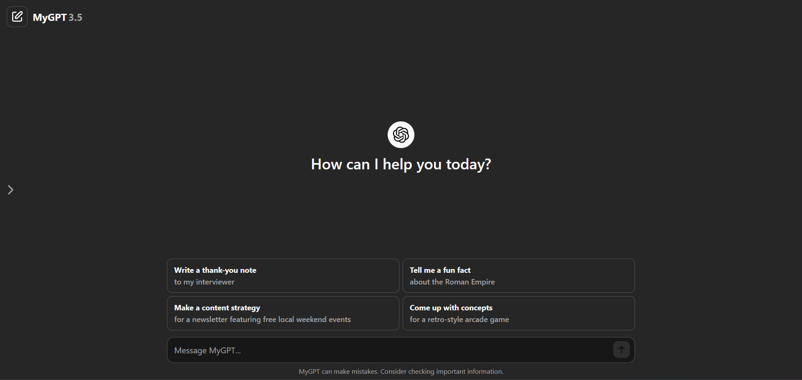
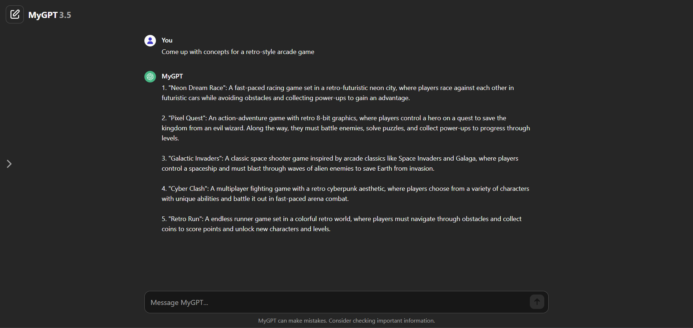
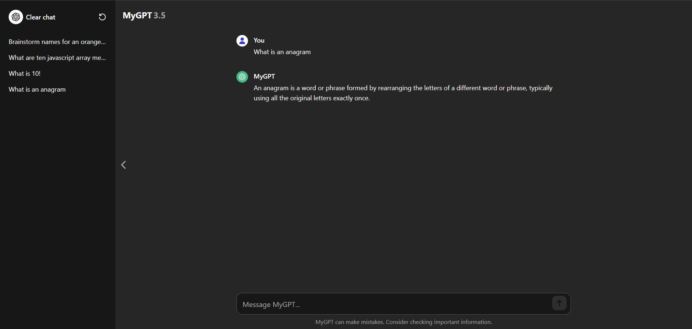

# MyGPT

### Table of Contents

-   [About](#about)
    -   [Tools](#tools)
    -   [Design](#design)
    -   [Challenges](#challenges)
    -   [What I Learned](#what-i-learned)
-   [Features](#features)
    -   [Mobile Navigation](#mobile-navigation)
    -   [Light/Dark Theme](#lightdark-theme)
-   [Getting Started](#getting-started)
    -   [Prerequisites](#prerequisites)
    -   [Installation](#installation)
-   [Contact](#contact)

# About

Since I use ChatGPT nearly everyday, I thought it would be relevant and fun to create a clone. I also wanted more practice with data fetching. MyGPT uses the OpenAI API for chat completion. Longer responses may be truncated due to token limit.



### Tools

&nbsp;
&nbsp;

### Design

I built each component (header, sidebar, mobile sidebar, main, bubbles, cards, textarea, footer) one-by-one, making sure that they were always responsive on different screen sizes and mimicked the behavior I was looking for. This was my first time creating sidebars. The mobile sidebar was a bit tricky and it still doesn't behave 100% like the original, but it's close.

### Challenges

One of the challenges for this project was getting the textarea to behave as intended. Instead of having the textarea use scrolling, the height will adjust dynamically based on the input. This function also resets the height to auto so that when text is removed, it will revert back to normal size. This gives a nice user experience when inputting their message.

```js
export const textareaHeight = () => {
	const textarea = document.querySelector('textarea');

	textarea.addEventListener('input', () => {
		textarea.style.height = 'auto';
		textarea.style.height = `${textarea.scrollHeight}px`;
	});
};
```

### What I Learned

This was my first time using local storage to save data on the user's preference for the theme. When the page is refreshed, the light and dark theme should render based off the previous visit rather than defaulting to one.

I worked a lot with conditional rendering with some elements having a default display of none, but when some condition is met they will render. For example, when hovering over the projects the buttons will appear.

As for more specifics, I learned about scroll-padding, window.scroll(), the window resize event listener, overflow-y, and using a boolean toggle for the mobile navigation. I also feel more proficient with Tailwind, media queries, and the overall process of developing one component at a time, mobile-first.

Concepts learned/practiced:

-   responsive design
-   local storage
-   light/dark theme toggle
-   mobile navigation
-   event listeners, handlers, toggles

# Features

### Randomized card suggestions

To mimick the randomized cards right above the textarea, I used an object of arrays to store the data. Each array represents a separate card. Inside each card are five objects, which have the data for the card. Here's an example of one card:

```js
card1: [
		{
			h4: 'Write a text message',
			p: 'asking a friend to be my plus-one at my wedding',
		},
		{ h4: 'Plan a trip', p: 'to see the northern lights in Norway' },
		{ h4: 'Write a thank-you note', p: 'to my interviewer' },
		{ h4: 'Give me ideas', p: `for what to do with my kid's art` },
		{
			h4: 'Suggest fun activities',
			p: 'for a family of 4 to do indoors on a rainy day',
		},
	],
```

Each card will be populated with one of five randomly-chosen suggestions whenever the page is loaded or refreshed. This formula generates a random number between 0 and 4, which are the indices of each card's objects.

```js
const randomNumber = Math.floor(Math.random() * 5);
```

Features:

-   Randomized card generation (5 options per card)
-   Clicking on a card will send a message and save it to history

### Dynamic UI

Once a message is submitted, the UI will clear the logo, text, and cards, leaving only the chat bubbles. I used classes to achieve this.

```js
const handleSubmit = () => {
	if (textarea.value.trim()) {
		mainLogo.classList.remove('flex');
		mainLogo.classList.add('hidden');
		h2.classList.add('hidden');
		cards.classList.add('hidden');
		main.classList.remove('justify-center');
		bubbles.forEach((bubble) => {
			bubble.classList.remove('hidden');
			console.log('clicked');
		});

		getResponse(saveMessage);
	}
};
```

The input bubble will be dynamically filled with the value of whatever the user types in (or clicks).



Features:

-   Dynamic UI via conditional classes
-   Chat bubbles dynamically filled with data from user, cards, or history

### Sidebar/chat history

The chat history will be saved to the sidebar which the user can then click and retrieve data from. I didn't implement local storage for this project, so the history will only be saved for the current chat session.

The sidebar is styled so that longer text will be truncated and the sidebar itself can be toggled with the chevrons.



Features:

-   Chat history saved to sidebar
-   When clicked, the message will be inserted into chat bubbles
-   Sidebar toggle with chevrons
-   Clicking anywhere outside the mobile sidebar will close it

### Textarea validation

# Getting Started

### Prerequisites

To get the project running on your machine, you'll need to have the following installed:

-   [Node.js](https://nodejs.org/)
-   [npm](https://www.npmjs.com/) or [Yarn](https://yarnpkg.com/)

### Installation

1. Clone the repository to your local machine:

```
git clone https://github.com/mshortcodes/mygpt.git
```

2. Change into the project directory:

```
cd mygpt
```

3. Install dependencies using npm:

```
npm install
```

4. Run the development server:

```
npm run dev
```

# Contact

Michael Short - mshortcodes@gmail.com

Project link:
