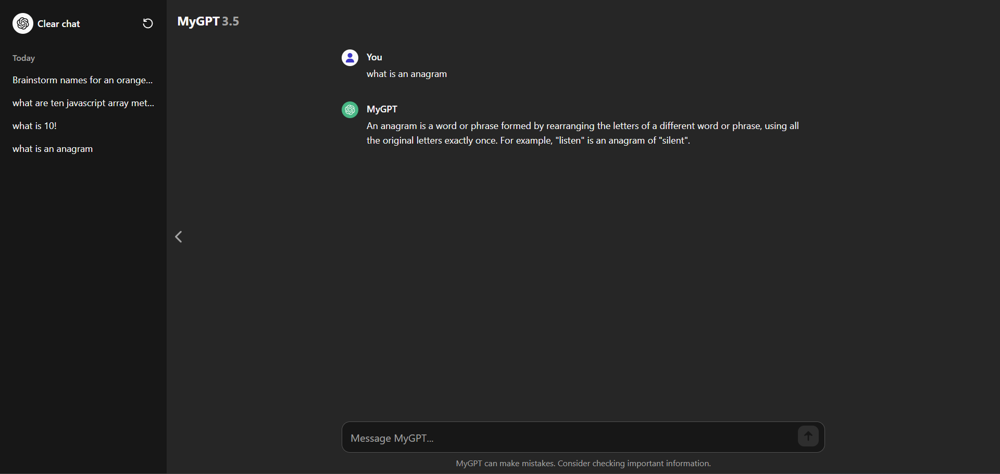

# MyGPT

### Table of Contents

-   [About](#about)
    -   [Tools](#tools)
    -   [Design](#design)
    -   [Challenges](#challenges)
    -   [What I Learned](#what-i-learned)
-   [Features](#features)
    -   [Randomized card suggestions](#randomized-card-suggestions)
    -   [Dynamic UI](#dynamic-ui)
    -   [Sidebar/chat history](#sidebarchat-history)
    -   [Validation](#validation)
-   [Getting Started](#getting-started)
    -   [Prerequisites](#prerequisites)
    -   [Installation](#installation)
-   [Contact](#contact)

## About

Since I use ChatGPT nearly everyday, I thought it would be relevant and fun to create a clone. I also wanted more practice with data fetching and implementing a given design. MyGPT uses the OpenAI API for chat completion. Longer responses may be truncated due to token limit.


### Tools

&nbsp;
&nbsp;

### Design

I built each component (header, sidebar, mobile sidebar, main, bubbles, cards, textarea, footer) one-by-one, making sure that they were always responsive on different screen sizes and mimicked the behavior I was looking for. This was my first time creating sidebars. The mobile sidebar was a bit tricky and it still doesn't behave 100% like the original, but it's close.

### Challenges

#### Layout/Sidebars

The layout was trickier than I had expected despite ChatGPT looking simple at first glance.

For larger devices I needed:

-   a header that remained fixed as the user scrolled but adjusts to the sidebar when open
-   a sidebar that opens/closes and also remains fixed
-   a main, scrollable section that respected the width of the sidebar when open

For smaller devices I needed:

-   a header that remained fixed
-   a sidebar that has an overlay effect
-   clicking anywhere outside the sidebar closes the sidebar and this area should expand and shrink

This took a lot of trial and error and testing how elements behaved on different screen sizes. I also had to consider longer responses when the page was scrollable.

I decided to make the body element flex, so that it essentially just has two direct children. This way I could make the 'main' area to the right use the flex-grow and flex-shrink properties. This allows it to expand when the sidebar is closed, and contract when it is open.

I made the header sticky so it sticks to the top of the viewport and gave it a high z-index so it covers other content. The mobile sidebar has an even higher z-index so that it covers the header, as well as an 'invisible' div where if you click anywhere it will close the sidebar. This div also uses flex-grow/shrink to take up as much space as there is available, while also shrinking before the sidebar does. I decreased the background opacity so that when the sidebar is open, other content appears dimmed.


#### Textarea

Another challenge for this project was getting the textarea to behave as intended. Instead of having the textarea use scrolling, the height will adjust dynamically based on the input. This function also resets the height to auto so that when text is removed, it will revert back to normal size. This gives a nice user experience when inputting their message.

```js
export const textareaHeight = () => {
	const textarea = document.querySelector('textarea');

	textarea.addEventListener('input', () => {
		textarea.style.height = 'auto';
		textarea.style.height = `${textarea.scrollHeight}px`;
	});
};
```

### What I Learned

This project helped me learn a bit more about asynchronous vs. synchronous programming, layouts, positions, and creating sidebars. I am still not fully confident in my understanding of promises and usage of async/await, but I think with repeated exposure I can get there. I often have to read, watch, and practice things many times before they completely click and digest with me. I did learn more about how JavaScript is single-threaded and more about callbacks.

Concepts learned/practiced:

-   data fetching
-   creating sidebars
-   dynamic UI
-   responsive design
-   DOM manipulation
-   conditional rendering

## Features

### Randomized card suggestions

To mimick the randomized cards right above the textarea, I used an object of arrays to store the data. Each array represents a separate card. Inside each card are five objects, which have the data for the card. Here's an example of one card:

```js
card1: [
		{
			h4: 'Write a text message',
			p: 'asking a friend to be my plus-one at my wedding',
		},
		{ h4: 'Plan a trip', p: 'to see the northern lights in Norway' },
		{ h4: 'Write a thank-you note', p: 'to my interviewer' },
		{ h4: 'Give me ideas', p: `for what to do with my kid's art` },
		{
			h4: 'Suggest fun activities',
			p: 'for a family of 4 to do indoors on a rainy day',
		},
	],
```

Each card will be populated with one of five randomly-chosen suggestions whenever the page is loaded or refreshed. This formula generates a random number between 0 and 4, which are the indices of each card's objects.

```js
const randomNumber = Math.floor(Math.random() * 5);
```

Features:

-   Randomized card generation (5 options per card)
-   Clicking on a card will send a message and save it to history

### Dynamic UI

Once a message is submitted, the UI will clear the logo, text, and cards, leaving only the chat bubbles. I used classes to achieve this.

```js
const handleSubmit = () => {
	if (textarea.value.trim()) {
		mainLogo.classList.remove('flex');
		mainLogo.classList.add('hidden');
		h2.classList.add('hidden');
		cards.classList.add('hidden');
		main.classList.remove('justify-center');
		bubbles.forEach((bubble) => {
			bubble.classList.remove('hidden');
		});
		addToday();
		getResponse(saveMessage);
	}
};
```

The input bubble will be dynamically filled with the value of whatever the user types in (or clicks).


Features:

-   Dynamic UI via conditional classes
-   Chat bubbles dynamically filled with data from user, cards, or history

### Sidebar/chat history

The chat history will be saved to the sidebar which the user can then click and retrieve data from. I didn't implement local storage for this project, so the history will only be saved for the current chat session.

The sidebar is styled so that longer text will be truncated and the sidebar itself can be toggled with the chevrons.



Features:

-   Chat history saved to sidebar
-   When clicked, the message will be inserted into chat bubbles
-   Sidebar toggle with chevrons
-   Clicking anywhere outside the mobile sidebar will close it

### Validation

I implemented some basic validation just to make sure no empty values can be submitted. Surprisingly, you can do just this on ChatGPT by pressing enter in the textarea twice. I disabled the default behavior of the enter key to prevent extra empty space from being created, as well as checked for a truthy value (any text). I made the submit button disabled by default and gave it a low opacity. When there is an input, it will have its full opacity.

```js
textarea.addEventListener('input', () => {
	if (textarea.value.trim()) {
		submitBtn.removeAttribute('disabled');
		submitBtn.classList.remove('opacity-10');
	} else {
		submitBtn.setAttribute('disabled', '');
		submitBtn.classList.add('opacity-10');
	}
});
```

## Getting Started

### Prerequisites

To get the project running on your machine, you'll need to have the following installed:

-   [Node.js](https://nodejs.org/)
-   [npm](https://www.npmjs.com/) or [Yarn](https://yarnpkg.com/)

### Installation

1. Clone the repository to your local machine:

```
git clone https://github.com/mshortcodes/mygpt.git
```

2. Change into the project directory:

```
cd mygpt
```

3. Install dependencies using npm:

```
npm install
```

4. Run the development server:

```
npm run dev
```

## Contact

Michael Short - mshortcodes@gmail.com

Project link: https://mygptclone.vercel.app/
